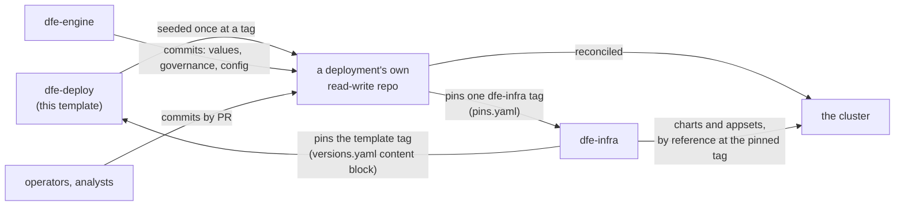

# dfe-deploy architecture

Why this repo is shaped the way it is, and the rules that are enforced rather
than written down and hoped for. The per-directory READMEs carry the detail for
each tree -- this page is the argument and the cross-tree invariants.

## The problem

A DFE deployment holds two kinds of state that change on different clocks.

HyperI ships one kind: charts, ApplicationSets, images, operators, tier
defaults. The deployment creates the other: which apps run and how many, how big
each one is, which sources feed it, which rules and hunts analysts wrote, which
OIDC providers authenticate people.

Put both in one repository and a base upgrade either overwrites the deployment's
own choices or has to be hand-merged forever. Vendor the base into the
deployment's repository and every upgrade is a merge conflict against files
nobody in that deployment wrote.

There is a second requirement on top. Every operational change has to be
auditable, and the deployment has to stay manageable when the engine and the UI
are both down. That rules out a database as the authority and it rules out the
API as the only way in.

## The shape that answers it

Split the two kinds of state, and make git the authority for the second.

- The base is REFERENCED by version. `pins.yaml` names a dfe-infra tag and the
  base is pulled at that tag by Argo multi-source, a Helm dependency or OCI. It
  is never copied in and never a submodule, so there is nothing to merge.
- The deployment's own state is OWNED outright, in a read-write repository per
  environment. A base upgrade is a one-line edit to `pins.yaml`.
- Every mutation is a commit, whoever makes it. dfe-engine commits, operators
  commit by pull request, and the git history is the audit trail either way.
  Editing the files directly still works, which is what keeps a deployment
  manageable with the control plane down.

This repository is only the seed for the second half.

Seeding happens three ways -- the bootstrap-created in-cluster Forgejo repo,
a forge template copy, or a clone at the release tag with the remote re-homed.
Never a fork: a fork of a public repo cannot be private, and fork lineage
invites merging template history, which is the one thing the pin model exists to
avoid.

## Why `values/` and `infra/` are separate trees

The dfe-infra ApplicationSet's git files generator globs `values/*-values.yaml`,
and Argo passes that glob to `git ls-files` as a pathspec. A pathspec without
`:(glob)` magic lets `*` match `/`. So `values/infra/kafka-values.yaml` matches
the glob and becomes an Argo application of its own.

That single fact drives the layout. `values/` holds app instances and nothing
else, not even in a subdirectory, because a subdirectory does not hide a file
from the generator. `infra/` therefore sits at the repository root, where a
pathspec anchored on `values/` cannot reach it, and takes the values for
everything that is not an app instance -- ClickHouse, Kafka, PostgreSQL,
FerretDB, the OTel collector, the network policies, the gateway config.

## The values cascade

Helm applies `-f` files in order and the last wins. The ApplicationSets stack
six layers, three from the base and three from the deployment:

| Layer | Source | Scope |
|---|---|---|
| `argocd/values/common.yaml` | dfe-infra | the product defaults |
| `argocd/values/<cloud>.yaml` | dfe-infra | cloud specifics |
| `argocd/values/profile-<profile>.yaml` | dfe-infra | the tier default |
| `infra/common.yaml` | here | deployment-wide facts every appset reads |
| `infra/<chart>.yaml` | here | one chart, platform and data appsets only |
| `values/<svc>-<inst>-values.yaml` | here | one app instance |

A profile file is a tier DEFAULT, not a lock, so a deployment can declare
`clickhouse.mode: external` in `infra/common.yaml` and beat
`profile-scale.yaml`. Before this layer existed the only way there was editing
dfe-infra.

A fact more than one chart consumes belongs in `infra/common.yaml` once, so the
network policy, the ClickHouse chart and the loader cannot disagree about it.

## Governed ops

`governance/` is the content behind the engine's governed-operations API, and it
is built so that a curated dial cannot become a general-purpose write.

- An action is a named bundle of var changes applied atomically in one commit.
  An operator granted `action:invoke:<name>` can pull that one lever without
  holding raw `helmvars:write`, and every invoke supports a dry run that returns
  the diff and commits nothing.
- Params are closed by construction. An enum carries its full value list, a
  numeric carries both bounds, and there is no free-string param type. Values
  substitute whole-value only, never into `cls`, `name` or `path`.
- An action may never change a governance class. That is a
  privilege-escalation guard, enforced at both validate and invoke, and
  independently by `tools/validate_governance.py`.
- A policy is a list of `cls:name:path` fnmatch patterns that locks matching vars
  against Tier-1 edits and against actions, unless the caller holds
  `helmvars:override`. The shipped `baseline` policy locks `image.*`, because
  image references move through stack pins rather than dials.

A policy governs the API, not the repository. A direct git commit still lands,
which is deliberate -- git is the authority and the API is a window over it.

## Invariants

These are the ones reading the files will not tell you.

1. Any `values/*-values.yaml` file IS an application. Creating one enables the
   app, deleting one removes it, and a scratch file spawns a phantom app.
2. An instance file without a `deploy:` block produces nothing at all. The
   ApplicationSet reads `deploy.service` and `deploy.instance` to name the Argo
   Application, so a file missing them yields no app and no error.
3. `config/schemas/` is ADDITIVE. An object whose definition sits under a core
   directory, or whose id the core manifest already declares, is refused by
   name. A refusal does not stop the core apply -- the rest converges and the
   refusal is reported on `GET /api/v1/system/schema`.
4. There is no DDL Job. dfe-engine applies every ClickHouse object and every
   bootstrap Kafka topic at its own startup, from the `dfe-schemas` wheel inside
   its image. That is why there is no `dfe-schemas` pin.
5. The data-store mode and storage model are chosen at deploy and refused
   afterwards, and replica counts are accepted upward only. Changing either on a
   live deployment is a data migration, not a values edit.
6. Object-store credentials never appear in these files. Both data charts read
   them from the environment, wired from a Secret the secrets store materialises.
7. Validation here is structural only. A chart renaming a dial var is caught by
   dfe-infra's chart validation, which owns the charts these paths point into.
8. Zero governance files is a FAILURE, not a pass. An empty result means the
   tree moved or the path is wrong, and a validator reporting success having
   checked nothing is the exact fault it exists to catch.

## What is deliberately not here

Per-user UI state -- saved searches, dashboards, preferences -- lives in the app
databases (HyperDX FerretDB), never in git. Secrets live in the secrets
store. Nothing in `config/` is a Kubernetes manifest, and Argo never applies it
as one: the apps and the engine read that tree directly off disk.
